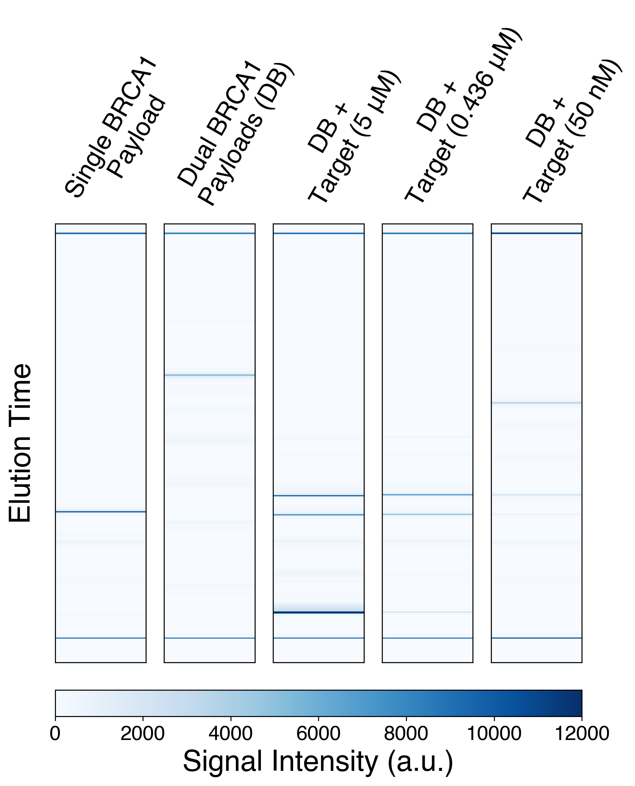
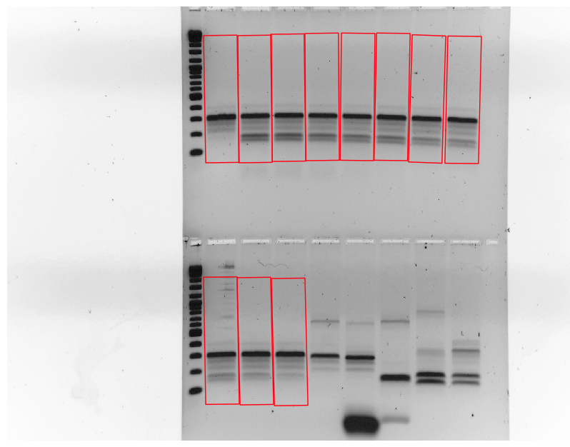
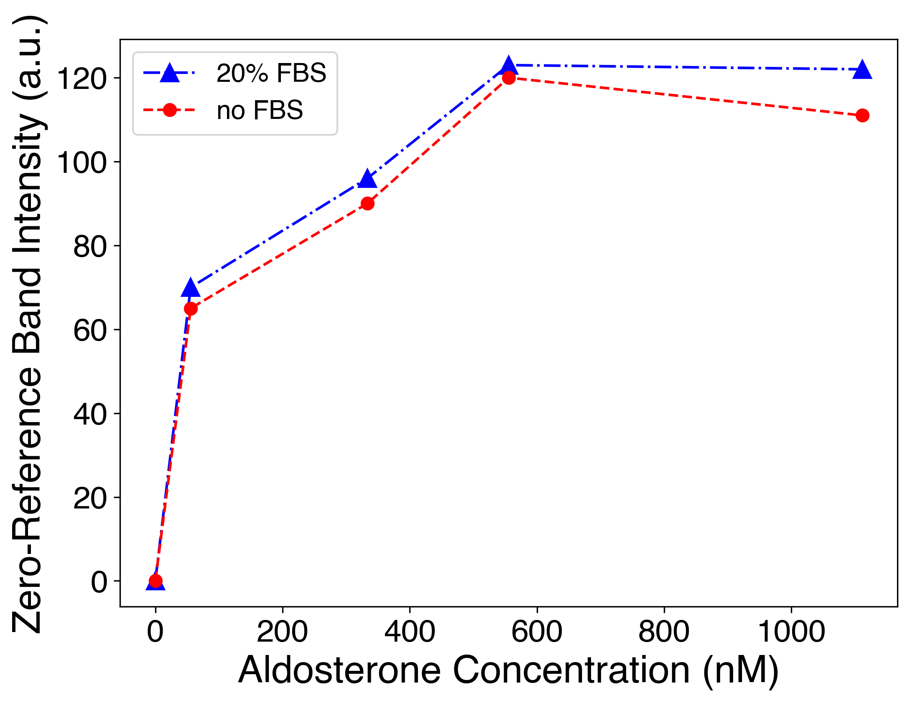

# Gel-Analysis-Scripts

### Description
Suite of Jupyter Notebook-based tools for interpreting and analyzing standard and capillary gel signals.  Also acts as the companion software to our publication in *Journal Name*.

Capabilities:
- GUI for manual selection of gel lanes and bands, with features available for enforcing lane length/width with arbitrary rotations.
- Analysis of lane data with automatic background correction and publication-quality plotting.
- Analysis and publication-quality plotting of capillary electrophoresis signal data from Agilent Fragment Analyzers.

Limitations:
- Can only work with one band per lane (currently)
- No options for inverting gel images.
- Capillary electrophoresis lane labelling requires manual intervention.
- UI unoptimized.

### Installation
To install, *ideally* create a new environment using Conda (or preferred Python environment manager):

```conda create -n gel_analysis python=3.7 # replace environment name and python version with user preference```

Then installed required packages as follows:

```conda install --file=requirements.txt -c conda-forge -c anaconda```

If you already have Scipy, Numpy, Jupyter, Ipywidgets, PIL, Matplotlib and Pandas, there is no need to create a new environment.

Tested using both Python 3.7 and 3.8 on Mac OS 12.x.  However, no OS-specific configuration/codes were used.

### Usage

- All capillary electrophoresis analysis code can be found in ```capillary_analysis.ipynb```
- The gel lane/band finder can be found in ```gel_lane_finder.ipynb```
- The gel image analysis script can be found in ```gel_trace_analysis.ipynb```

Example standard gel/capillary gel data can be found in the supplementary files of the linked paper (*add link*).

### Example Outputs

Capillary electrophoresis analysis

Lane selection output

Standard gel trace plot (after background subtraction)


### Development
Any additional contributions welcome, especially on user interface (both command-line and GUI).
